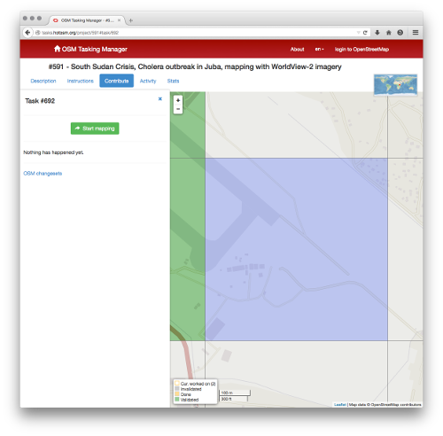

# About this practical

## 

This session will walk you through the process of editing a targeted area of
OpenStreetMap, the largest collective effort to create a map of the World
(think of it as the WikiPedia of maps). Use the red arrows to navigate through
the slides. 

* An online version is available at [**http://darribas.org/bham_avd_osm**](http://darribas.org/bham_avd_osm)
* A **pdf** version of this document is available
[here](https://github.com/darribas/bham_avd_osm/blob/gh-pages/index.pdf?raw=true).

# Background

## 

In this practical, you are going to learn how to contribute to the
OpenStreetMap (OSM) project, helping map parts of the world at risk of
humanitarian disaster. To do that, you will be using satellite images that
will help you identify objects on the ground, such as buildings or roads, so
you can draw them, effectively adding them to the map. The selection of areas
in need will be taken care of by the Humanitarian OpenStreetMap Team (HOT).

## 

OSM is the largest collective effort to create a digital free map of the
entire World contributed by volunteers. Think of it as the WikiPedia of maps.
Started in 2004 at UCL, it has grown substantially over the years and,
currently, parts of the map provide better quality data than comercial
alternatives such as Google Maps.

## 

The HOT is the arm of OSM that is concerned with maximizing the impact of the
Map for humanitarian purposes. As such, it connects traditional efforts in
humanitarian relief with the OSM. Having reliable and accurate spatial data is
crucial for humanitarian missions because it allows to manage scarce resources
in more efficient ways. One of its missions is to keep updated the Tasking
Manager, a list of urgent parts of the world to be mapped. In this practical,
we will be using the Tasking Manager to select the area that we will be
editing.

## Like this??? Here's more!

If you are interested in these issues, follow up on these links:

* OpenStreetMap info page http://www.openstreetmap.org/about
* HOT project page: http://hotosm.org/
* Link to the Task Manager: http://tasks.hotosm.org/

# What to do

## 

**1** - Make sure you have your password at hand.

## 

**2** - Go to the Tasking Manager list to pick an area of the world in need of
mapping. To do that, open up a (modern, e.g. Firefox, Chrome) browser and
follow this url:

http://tasks.hotosm.org/

You should see something like this:

## 

This is essentially a list of top priorities to be mapped around the World.
Pick the one you prefer by clicking on its title.

## 

**3** - In this example, we will be editing task #591 which relates to the
South Sudan Crisis. You should then see something that looks more or less like
this:

The text on the left provides a bit of background on the area.

## 

**4** - Click on “Instructions”, this shows what you are expected to map (roads,
   streets, buildings…) as well as the source of the satellite imagery.

## 

**5** - Click on “Start contributing” and either click a polygon on the map
in the right, or click on “Take a task at random” to let the computer select
it for you. You’ll be zoomed into a specific area of the map, this is where
you will be editing.

## 

**6** - Now click on “Start Mapping”. If you haven’t logged in, you will need to:
   enter the account name and password provided and, on the next page, click
   on “Save changes”. When you’re redirected to the area to map, click “Start
   Mapping” again. You should see something like this:

## 

**7** - Select “Edit with iD editor” and a new tab/window will open with the editor
   where you can make changes. Ready to map!!!

## 

**8** - Now spot an object such as a building in the image that has not been
added to the map (that is, that does not have a map object, such as a building
footprint, drawn onto it). Click on “Area” on the top-left of the map:

## 

**9** - Use the mouse to click through the shape of the object you would
like to map:

## 

**10** - Select the kind of object it is. In this example: “Building --> House”.
    Save the changes by clicking “Save” in the upper right part of the map.

**11** - Click “Save” on the left hand side bar. You are done! You have just
        contributed making the world a more mapped place!

# License

## 

Content by [Dani Arribas-Bel](http://darribas.org) and the University of
Birmingham, licensed under [Creative Commons Attribution 4.0 International License](http://creativecommons.org/licenses/by/4.0/).

Materials available at [https://github.com/darribas/bham_avd_osm](https://github.com/darribas/bham_avd_osm)

